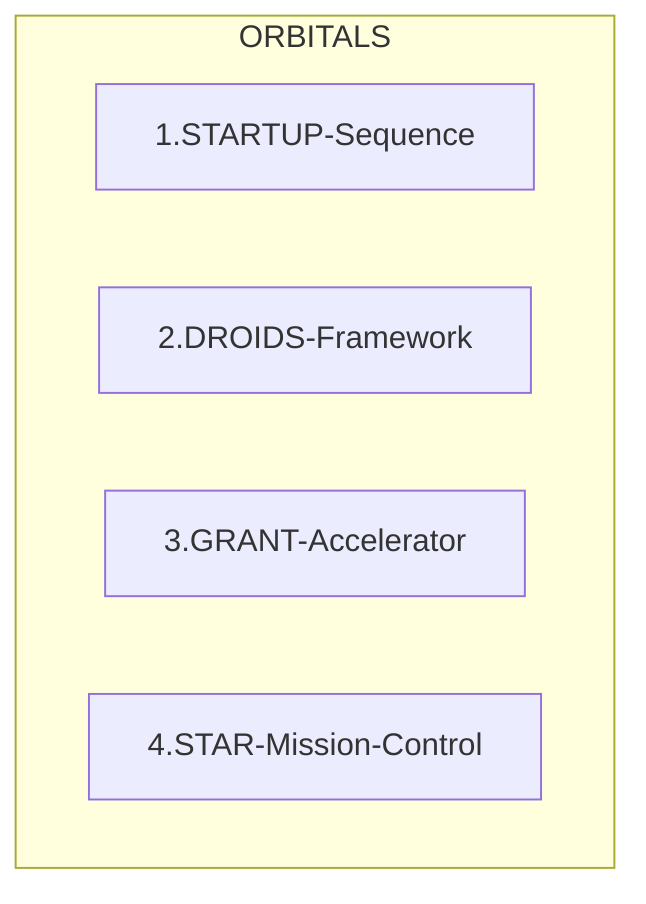

# FLOWCHART TO ORBITAL MISSION

## ORBITAL Mission Control
Orbital mission control has 4 step sequences
 
### ORBITAL:
1. STARTUP Sequence
2. DROIDS Framework
3. GRANT Accelerator
4. STAR Mission Control

